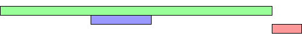

# 1.-Ventajas de incorporar el script desde un fichero externo frente a hacerlo en línea (código javascript directamente en el fichero HTML)
- Mejor legibilidad en el código al no estar mezclado con HTML
- Mayor control de este, por lo mismo que el punto anterior
- Reutilización de funciones
- Modularización de aplicaciones
- Permite usar un mismo fichero JS para varios ficheros HTML

# 2.-Atributos aplicables a la etiqueta script
- **async**
- **integrity:** Contiene información de metadatos usada por el user agent del navegador.
- **src:** Especifica la URI del script externo.
- **type:** Para definir el tipo de lenguaje a usar.
- **text**
- **defer** 
- **~~lenguaje~~:** Parecida a type, esta no se usa, siempre se debe usar type.

# 3.-Atributos por defecto.
El atributo por defecto sería el type, cogiendo javascript como lenguaje

# 4.-Atributos booleanos. Qué implican.

Los atributos booleanos serían **async** y **defer.**
**async:** Provoca que se descargue el script de manera asíncrona al código html, cuando el script está listo, el html se para y se ejecuta el script, para así no tener problemas con el html, entonces cuando se ejecuta el script, el html reanuda su descarga.

**defer:** Provoca al igual que async la descarga asincrona del script y el html, pero a diferencia de este, el script se ejecuta una vez se haya descargado por completo el html.

# 5.-Sitio recomendado para colocar la etiqueta script.
Lo más común es ponerla en el head, junto con el atributo async o defer, ya que el proceso de carga de una página html que contiene un script, empieza por el html hasta que encuentra el script, este tiene que buscar el archivo donde está contenido el script y ejecutarlo, lo que deja el html sin acabar hasta que se ejecute, por último cargará el resto del html.
Muestra gráfica del proceso:

# 6.-Etiqueta noscript: utilidad, atributos y dónde colocar
Es una etiqueta que sirve para avisar al usuario que su navegador no tiene activo javascript y que por tanto, no podrá visualizarse correctamente la página web, es importante ponerlo, dado que quizá el usuario no tenga conocimientos y no sepa porque no le funciona correctamente la página.
